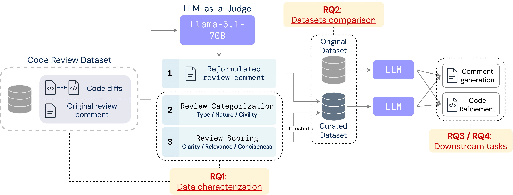

CuREV: Curating Review Comments for Improved Code Review Automation
===============================

<p align="center">
    <a target="_blank" href="https://arxiv.org/abs/2502.03425"></a>
    <a target="_blank" href="https://huggingface.co/datasets/OussamaBS/CuREV"></a>
    <a target="_blank" href="https://doi.org/10.5281/zenodo.14812107"></a>
    <a target="_blank" href="https://github.com/OussamaSghaier/CuREV/blob/main/LICENSE"></a>
</p>
<p align="center">


</p>

This is the replication package accompanying our paper, *Curating Review Comments for Improved Code Review Automation*.

The datasets of this paper are available on [Zenodo](https://zenodo.org/records/14812107) and [HuggingFace 🤗](https://huggingface.co/datasets/OussamaBS/CuREV).
  
Latest Updates 🚀
---
> [!NOTE]
> 
>> **[11-02-2025]** 🤗 CuREV is now available on Hugging Face! You can access it [here](https://huggingface.co/datasets/OussamaBS/CuREV). 
>
>> **[05-02-2025]** 🔥 We release the first version of CuREV and the complete replication package of our paper.
> 
>> **[12-01-2025]** 📢 Our paper has been accepted for MSR 2025! Read it on [arXiv](https://arxiv.org/abs/2502.03425).  


Overview
---
We propose a methodology to curate a code reviews dataset to enhance its quality and improve the performance of language models on code review downstream tasks, namely comment generation and code refinement.

<div align="center">



_Overview of our curation pipeline for code reviews to create CuREV dataset (see [our paper](https://arxiv.org/abs/2502.03425) for more details)._
</div>

The main contributions of this work are threefold: 
(1) *A data-centric evaluation framework*, 
(2) *A curation pipeline to improve the quality of review comments*, and 
(3) *Evaluation of the curated dataset, compared to the original, on downstream tasks (i.e, comment generation and code refinement)*.

<!-- Navigation Menu (Table of Contents) -->
## Table of Contents
- [Project structure](#project-structure)
- [Environment setup](#environment-setup)
- [Data](#data)
- [Models](#models)
- [1- A Data-Centric Evaluation Framework](#1--a-data-centric-evaluation-framework)
- [2- CuREV: a Curated Dataset for Code Review](#2--curev-a-curated-dataset-for-code-review)
- [3-a. Comment Generation](#3-a-comment-generation)
- [3-b. Code Refinement](#3-b-code-refinement)
- [Contributors](#contributors)
- [Citation](#citation)

Project structure
---
The project is structured as follows.
    
    .
    ├── code_refinement/        # Code refinement package
    ├── comment_generation/     # Comment generation package
    ├── quality_assessment/        # empirical study package
    ├── data_curation/          # dataset curation package
    ├── util/                   # package for helpers and config
    ├── data/                   # Folder for dataset and results
    ├── models/                 # Folder for large language models
    ├── requirements.txt        # required python libraries


## Environment setup

There are two ways to set up the environment to run the project and use the scripts. Choose the method that best suits your workflow: *python virtual environment* or *docker*.

### A. Python virtual environment

This method involves setting up a python virtual environment to isolate the dependencies required by the project. Follow the steps below to create the environment, install the necessary libraries, and verify the installation.

To facilitate usage and results replication, we include a file ```requirements.txt``` to install the required python libraries.
Here are the instructions to create a virtual environment, activate it, and install dependencies using the provided `requirements.txt` file:

1. **Create a Virtual Environment**  
   Run the following command to create a virtual environment named `venv`:
   ```bash
   python3 -m venv venv
   ```

2. **Activate the Virtual Environment**  
   - On **macOS/Linux**:
     ```bash
     source venv/bin/activate
     ```
   - On **Windows**:
     ```bash
     .\venv\Scripts\activate
     ```

3. **Install Dependencies**  
   With the virtual environment activated, install the required Python libraries from `requirements.txt`:
   ```bash
   pip install -r requirements.txt
   ```

4. **Verify the Installation**  
   To confirm that all dependencies are installed correctly, run:
   ```bash
   pip list
   ```

5. **Deactivating the Environment**  
   When you’re finished, you can deactivate the virtual environment with:
   ```bash
   deactivate
   ```

### B. Docker

Alternatively, you can run the project within a Docker container. This setup makes it easy to run the project in a containerized environment. 

#### Prerequisites

- Docker installed on your system. You can download it from [here](https://www.docker.com/get-started).

#### Steps to Run with Docker

1. **Build the docker image**  
   Open a terminal in the root directory of the project and run the following command to build the Docker image:
   ```bash
   docker build -t curev .
   ```
      This will create a Docker image named curev based on the provided Dockerfile.
2. **Create the docker container**   
   After building the image, you can create a docker container using:
   ```bash
   docker run -it --name curev-container curev-image
   ```
      The above command should be run once (the first time) to create a container from the built image. For subsequent attempts, we should use the following commands to start and connect to the created docker container:      
   ```bash
   docker start curev-container
   docker exec -it curev-container bash
   ```
      To stop the container:
   ```bash
   docker stop curev-container
   ```
      The project is now set up to run within a Docker container for your project, and you can easily start, connect, and stop the container as needed.


4. **Verify the Installation**  
   To confirm that all dependencies are installed correctly, run:
   ```bash
   pip list
   ```


## Data

The original code review dataset is available in [Zenodo](https://zenodo.org/records/6900648).
To run the experiments, you need to download ```Code_Refinement.zip``` and place the dataset under the ```data/``` folder.
You can use the utilities method *create_HFdataset* in ```util.dataset``` to merge the downloaded jsonl files into a HuggingFace dataset. 

## Models

We run *Llama-3.1-70B* on our local machines using [ExLlamaV2](https://github.com/turboderp/exllamav2) to geneerate accurate judgments using our defined evaluation framework.
You can choose the [same model](https://huggingface.co/hugging-quants/Meta-Llama-3.1-70B-Instruct-GPTQ-INT4) or any other model.
Or, you can to download a quantized version of any other model that is compatible with *ExLlamaV2*.
The downloaded model should be placed under the folder ```models/```.


## 1- A data-centric evaluation framework

We propose an evaluation framework to categorize and assess the quality of code reviews. It consists of (1) a **categorization scheme** to classify the *type*, *nature*, and *civility* of code review comments, and (2) **scoring criteria** to assess the overall quality of code reviews based on their *relevance*, *clarity*, and *conciseness*. We apply our evaluation framework to the largest existing dataset of code reviews. Given the scale of the dataset, we utilize a large language model (LLM) as a judge to automatically annotate samples with thoroughly designed prompts to ensure reliable and consistent annotations.

The experiments conducted for this contribution are available under the folder ```quality_assessment/```.

To run the LLM judgments:
```bash
python quality_assessment/inference.py \
      --model_dir="models/Meta-Llama-3.1-70B-Instruct-GPTQ-INT4/" \
      --dataset_path="data/Code_Refinement/CRdataset" \
      --save_steps=5000
```
The full list of arguments is available in ```util/config.py```.


## 2- CuREV: a curated dataset for code review


The experiments conducted for this contribution are available under the folder ```data_curation/```.

To run the experiments for reformulating review comments:
```bash
python reformulate_reviews/inference.py \
      --model_dir="models/Meta-Llama-3.1-70B-Instruct-GPTQ-INT4/" \
      --dataset_path="data/Code_Refinement/CRdataset" \
      --output_path="data/eval_results/reform_results.jsonl" \
      --save_steps=5000
```
The full list of arguments is available in ```util/config.py```.


## 3-a. Comment generation


The experiments conducted for this contribution are available under the folder ```comment_generation/```.

- To train a language model on comment generation on the original dataset:
```bash
python comment_generation/sft_init.py \
      --model_name_or_path="deepseek-ai/deepseek-coder-6.7b-instruct" \
      --dataset_path="data/Code_Refinement/CRdataset" \
      --output_path="data/eval_results/reform_results.jsonl" \
      --save_steps=200 \
      --checkpoint_path="models/comment_generation/init_ckpts" \
      --output_path="models/comment_generation/final_model"
```

- To train a language model on comment generation on the original dataset:
```bash
python comment_generation/sft_cur.py \
      --model_name_or_path="deepseek-ai/deepseek-coder-6.7b-instruct" \
      --dataset_path="data/Code_Refinement/CRdataset_reform" \
      --output_path="data/eval_results/reform_results.jsonl" \
      --save_steps=200 \
      --checkpoint_path="models/comment_generation/init_ckpts" \
      --output_path="models/comment_generation/final_model"
```

- To run the inference on the initial or curated dataset:
```bash
python comment_generation/hf_inference-init.py
python comment_generation/hf_inference-cur.py
```

- To run the evaluation of both model:
```bash
python comment_generation/evaluation.py"
```


- The full list of arguments is available in ```util/config.py```.


## 3-b. Code refinement


The experiments conducted for this contribution are available under the folder ```code_refinement/```.

- To run the inference of a model for code on the initial dataset:
```bash
python comment_generation/hf_inference-init.py \
      --model_name_or_path="deepseek-ai/deepseek-coder-6.7b-instruct" \
      --dataset_path="data/Code_Refinement/CRdataset" \
      --output_path="data/eval_results/reform_results.jsonl" \
      --save_steps=1000 \
      --output_path="models/init_coderef_results.jsonl"
```

- To run the inference of a model for code on the curated dataset:
```bash
python comment_generation/hf_inference-cur.py \
      --model_name_or_path="deepseek-ai/deepseek-coder-6.7b-instruct" \
      --dataset_path="data/Code_Refinement/CRdataset_reform" \
      --output_path="data/eval_results/reform_results.jsonl" \
      --save_steps=1000 \
      --output_path="models/cur_coderef_results.jsonl"
```

- To run the evaluation of both model:
```bash
python comment_generation/evaluate.py"
```

- The full list of arguments is available in ```util/config.py```.


## Contributors

For questions, collaborations, or further discussion, please feel free to reach out to any of our contributors via email or open an issue on GitHub.    
| Name | Contact | Github |
|:-----:|------------|---------|
| **Oussama Ben Sghaier** | [oussama.ben.sghaier@umontreal.ca](oussama.ben.sghaier@umontreal.ca)<br/> | [OussamaSghaier](https://github.com/OussamaSghaier) | 
| **Martin Weyssow** | [mweyssow@smu.edu.sg](mweyssow@smu.edu.sg)<br/> | [martin-wey](https://github.com/martin-wey) | 
| **Houari Sahraoui** | [sahraouh@iro.umontreal.ca](sahraouh@iro.umontreal.ca)<br/> |  | 


## Citation

```bibtex
@misc{sghaier2025harnessinglargelanguagemodels,
      title={Harnessing Large Language Models for Curated Code Reviews}, 
      author={Oussama Ben Sghaier and Martin Weyssow and Houari Sahraoui},
      year={2025},
      eprint={2502.03425},
      archivePrefix={arXiv},
      primaryClass={cs.SE},
      url={https://arxiv.org/abs/2502.03425}, 
}
```
